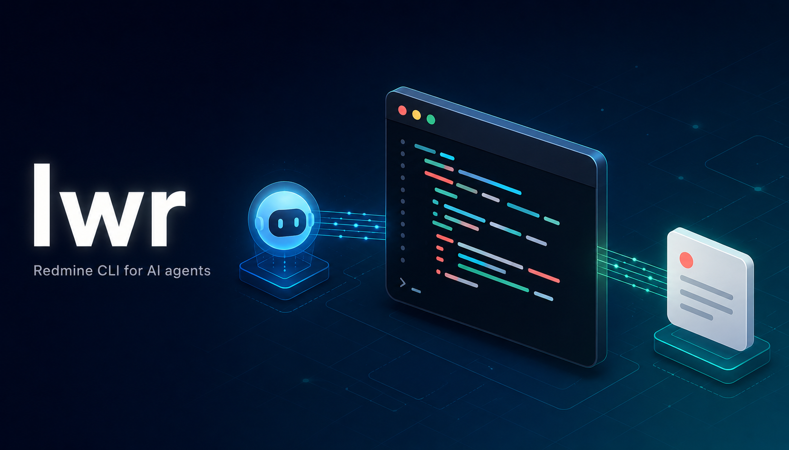

<p align="center">
  
</p>

<p align="center">
  <a href="https://opensource.org/licenses/MIT"></a>
  <a href="https://nodejs.org"></a>
  
  <a href="https://modelcontextprotocol.io"></a>
</p>

A standalone Redmine CLI built for AI agents. Every command speaks a stable `--json` envelope, fails with typed `code` strings and distinct exit codes, and never blocks on a prompt in non-TTY contexts. Humans get colored output and a self-test (`lwr doctor`).

> [!NOTE]
> **Status:** Foundation, JSON envelope, MCP server (`lwr serve --mcp`), SKILL.md + recipes, daily work-log, and self-bootstrap commands have shipped. The TUI (`lwr dash`) and shell completions are next.

---

## ⚡ Quick start

```bash
git clone <repo> lw-redmine
cd lw-redmine
node install.mjs install     # build, link, mirror SKILL.md to detected AI tools

lwr auth login --username <you>
lwr issue list --json
```

Details below.

---

## 📦 Install

```bash
git clone <repo> lw-redmine
cd lw-redmine
node install.mjs install
```

The installer:

1. Verifies Node ≥ 20.
2. Runs `npm install` + `npm run build` if needed.
3. Globally links the `lwr` binary (`npm link`) — `lwr` is now on your `PATH`.
4. Snapshots `SKILL.md` and `recipes/` to `~/.lwr/skill/` (the canonical location).
5. Detects installed AI tools and symlinks the canonical skill bundle into each:
   - `~/.claude/skills/lw-redmine/` (Claude Code)
   - `~/.copilot/skills/lw-redmine/` (GitHub Copilot)
   - `~/.codex/skills/lw-redmine/` (Codex CLI)
   - `~/.gemini/antigravity/skills/lw-redmine/` (Gemini Antigravity)

Tools whose dotdir isn't present are skipped silently. Re-running `install` is idempotent.

Verify:

```bash
which lwr && lwr --version
node install.mjs status
```

### Update

```bash
lwr update                   # discoverable wrapper around `node install.mjs update`
# or
node install.mjs update      # git pull (if clean) → rebuild → refresh canonical skill
```

Because every AI tool symlinks the same canonical bundle, `update` only writes `~/.lwr/skill/` once — the symlinks pick it up automatically.

### Uninstall

```bash
node install.mjs uninstall   # removes binary + all skill symlinks; preserves ~/.lwr user data
```

To wipe profile + caches too: `rm -rf ~/.lwr` afterward.

<details>
<summary>Manual install (without the installer script)</summary>

```bash
git clone <repo> lw-redmine
cd lw-redmine
npm install
npm run build
npm link                     # puts `lwr` on your $PATH
```

You'll then need to run `lwr update-skill` manually to mirror the skill into AI-tool folders.

</details>

---

## 🤖 For AI agents

`lwr` is built to be the substrate under Claude Code / Copilot / Cursor / any MCP-speaking agent.

### One-paste install (for the agent)

```bash
git clone <repo> lw-redmine
cd lw-redmine
node install.mjs install
```

After install completes, run `lwr auth login` to wire up the Redmine profile.

### MCP setup (Cursor / Cline / Zed / generic MCP clients)

`lwr` doubles as an [MCP](https://modelcontextprotocol.io) server. Any agent that speaks MCP can connect to it over stdio — no shell access required, no SKILL.md loading, no Claude-Code-specific setup.

Once `lwr` is on your `$PATH`, point your MCP client at `lwr serve --mcp`. Config snippets:

**Cursor** (`~/.cursor/mcp.json` or per-project `.cursor/mcp.json`):

```json
{
  "mcpServers": {
    "lwr": {
      "command": "lwr",
      "args": ["serve", "--mcp"]
    }
  }
}
```

**Cline / Continue / Zed** — same shape; look up the file path each tool reads. The `command` + `args` pair is the only thing that varies.

**Generic / hand-rolled clients** — spawn `lwr serve --mcp` over stdio, send JSON-RPC over `stdin`/`stdout` (newline-delimited).

What the agent gets:

- **Every CLI verb as an MCP tool.** Tool name is the dotted command path with `.` → `_` (`issue.list` → `issue_list`, `time.log` → `time_log`). Each tool advertises `readOnlyHint` / `destructiveHint` / `idempotentHint` / `openWorldHint` for approval-UI gating.
- **`lwr://me` as a resource.** The agent can `resources/read` to load the rendered identity context (Redmine user, roles, custom-field bindings, project memberships) — same content as `~/.lwr/me.md`.
- **Same JSON envelope as the CLI.** Every `tools/call` response carries `schema: lwr/v1`, `requestId`, and `commandMeta`. The CLI and MCP surfaces share one source of truth (`COMMAND_ANNOTATIONS`).
- **Same auth.** The MCP server inherits the local keytar/auth.json state set up by `lwr auth login`. No separate auth flow.

### The contract

- Every command takes `--json`. Output is the `lwr/v1` envelope (schema below).
- Errors include a stable `error.code` string (e.g. `AUTH_INVALID`, `NOT_FOUND`, `RATE_LIMITED`, `VALIDATION_MISSING_FLAG`) — branch on these rather than parsing message text.
- Exit codes are stable (table below).
- Non-TTY contexts never prompt; missing required values produce a structured `VALIDATION_MISSING_FLAG` error with a `hint` naming the flag to pass.
- The TUI (`lwr dash`, Phase 3) is the **only** way to enter Ink — agents that mistakenly invoke it in a non-TTY get a clean `TUI_REQUIRES_TTY` error, not a frozen process.
- Every interactive prompt has a flag equivalent (no flow is reachable only via prompting).

### For unsupported AI hosts

If your host isn't one of the four auto-detected tools (Kilo, Continue, future tools), self-bootstrap with:

```bash
lwr skill-paths --json                                   # discover where the canonical skill lives
lwr install-skill --target ~/.<your-host>/skills/lw-redmine --json   # symlink into your tool's folder
```

`install-skill` refuses targets outside `$HOME` so a typo can't write to system directories.

---

## 🔐 First-run login

`lwr` stores credentials in the OS keychain via [keytar](https://github.com/atom/node-keytar) (Keychain on macOS, libsecret on Linux, Credential Vault on Windows), with a `chmod 600` JSON fallback under `~/.lwr/auth.json` if the keychain is unavailable. The password is exchanged for an API key on first login and immediately discarded — it's never persisted.

### Recommended — interactive login

Works for humans and for AI-agent-driven onboarding:

```bash
lwr auth login                       # prompts for username + password
lwr auth login --method api-key      # prompts for an existing API key instead
```

**For AI agents:** do not run `lwr auth login` yourself. Ask the user to open a separate terminal, run the command there, and return when it succeeds. This keeps the credential out of your conversation context, shell history, and process arguments. Once the user confirms login, verify with `lwr auth whoami` and proceed.

### CI / scripted environments

Set the API key via the runner's secret manager so it's never in shell args or history:

```bash
LWR_API_KEY=<key> lwr auth login
```

### Verify

```bash
lwr auth whoami
```

### Advanced — direct inline flags (humans only)

```bash
lwr auth login --username <login> --password '...'   # bypasses prompts
lwr auth login --api-key <key>                       # store an existing key
```

> ⚠️ **AI agents must not use these.** Inline credentials end up in chat transcripts, shell history (`~/.zsh_history`, `~/.bash_history`), and `ps aux`. They exist for direct human use only.

### Multiple Redmine instances

Profiles wrap a baseUrl + per-profile API key. Switch instances with `lwr profile use <name>`, or override per-call with `--profile <name>`.

---

## 🛠️ Commands

The canonical, machine-readable list of every command (with args, options, safety class, idempotency, and network behaviour):

```bash
lwr commands --json
```

A summary of the command groups:

| Group | What |
|---|---|
| `lwr auth` | login, logout, whoami |
| `lwr profile` | manage Redmine profiles (multiple instances) |
| `lwr me` | inspect/correct the per-profile identity (roles, custom-field map) |
| `lwr project` | list, switch active, show members, versions |
| `lwr issue` | list, view, edit, attach, status, close, assign, watch, transitions, fetch, create, note |
| `lwr time` | log / list / edit / delete time entries |
| `lwr log` | daily work-log — agent-driven session journal at `~/.lwr/log/` |
| `lwr user` | resolve names → ids; manual fallback list |
| `lwr cache` | inspect, refresh, clear the metadata cache |
| `lwr search` | full-text search across issues, wiki, news, documents, etc. |
| `lwr serve` | run as an MCP server (stdio) |
| `lwr commands` | introspect the CLI tree (no network) |
| `lwr doctor` | runtime / config / auth / network self-test |
| `lwr update` | full repo update — git pull → rebuild → relink → skill snapshot |
| `lwr update-skill` | refresh `SKILL.md` + recipes in the four detected AI tools |
| `lwr skill-paths` | print canonical paths + per-tool symlink state |
| `lwr install-skill` | symlink the skill bundle into one named target (`$HOME`-guarded) |

Run `lwr <group> --help` for full flag info on any subcommand.

---

## 📋 Cheatsheet

<details>
<summary>Click to expand a copy-pasteable cheatsheet covering the most common workflows.</summary>

```bash
# What's on my plate
lwr issue list --me

# Look at one issue
lwr issue view 64602
lwr issue view '#64602' --no-detail   # skip journals/attachments

# Materialise an issue + attachments to ~/.lwr/issues/<id>/ (cached)
lwr issue fetch 64602                 # downloads + converts (PDF → PNG, etc.)
lwr issue fetch 64602 --force         # re-download
lwr issue fetch 64602 --no-convert    # keep originals only

# Move an issue forward — these verbs are shortcuts over `issue edit` with name resolution
lwr issue status 64602 "In Progress" --note "starting"
lwr issue assign 64602 me
lwr issue watch  64602
lwr issue close  64602 --note "shipped in #PR-123"
lwr issue open   64602                  # prints URL (--browser launches in TTY)

# Workflow-aware status transitions — every status verb (`status`, `close`,
# `edit --status …`) preflights against `allowed_statuses` for the current
# user; a forbidden transition errors with `WORKFLOW_NOT_ALLOWED` *before*
# any PUT and includes `details.allowed: [{id,name,is_closed}]` so agents
# can recover without re-fetching.
lwr issue transitions 64602             # what can I move it to right now?
lwr status list                         # full instance dictionary (id ↔ name)
lwr issue edit 64602 --status "Testing Pending" --notes "ready for QA"

# End-to-end agent flow: "assign 'EPIC - X' to Jane Doe and set status to New"
ID=$(lwr search "EPIC - Enhancement of Consolidate" --types issue --json \
       | jq -r '.data.results[0].ref' | tr -d '#')
lwr issue edit "$ID" --assignee "Jane Doe" --status "New" --notes "kicking off"
#  └─ resolves "Jane Doe" via this issue's project members (cache-first),
#     resolves "New" via the cached statuses dictionary, preflights both
#     against allowed_statuses, then issues a single PUT.

# User resolver — manual lookups + the fallback path for permission-locked instances
lwr user resolve "Jane Doe" --issue 64602       # uses issue's project members
lwr user list   --project 51 --search jdoe      # filter cached members
lwr user import users.json                      # manual fallback for non-admins

# Cache management — see what's stored, force a refresh, or clear it
lwr cache list                                  # statuses + per-project members + manual users
lwr cache refresh                               # re-pull statuses + every cached project
lwr cache clear --type projects                 # drop project-member caches; keep statuses + manual

# Drop a quick note
lwr issue note 64602 --message "follow-up: ..."
echo "longer note" | lwr issue note 64602 --message-file -

# Attach files (multi-file in a single PUT — one journal entry, not N)
lwr issue attach 64602 ./screenshot.png ./logs.txt \
  --message "repro for the crash on submit"

# Cross-resource search (issues, wiki pages, …) — JSON returns a stable `ref`
lwr search "consolidated marksheet" --types issue --open --limit 5
lwr search "release notes" --types wiki --json | jq '.data.results[].ref'

# Open a new ticket
lwr issue create --project lw --subject "Fix X" \
  --description-file ./bug-report.md

# Browse projects — every --project flag accepts {numeric id, identifier slug, human name}
lwr project list --all
lwr project use "Acme Portal V2"                # name resolves via cached index
lwr project members am --all                    # identifier slug
lwr project versions 51                         # numeric id
lwr project resolve "Acme Portal V2"            # debug: see which match path won

# All other --project consumers accept names too — same resolver:
lwr issue list  --project "Acme Portal V2" --me
lwr issue create --project "Acme Portal V2" --subject "..."
lwr user list   --project "Acme Portal V2" --search jdoe
lwr search "..." --search-project "Acme Portal V2"

# Switch instances
lwr profile use staging

# Self-test the install (runtime, config, auth, network, converters, terminal)
lwr doctor
lwr doctor --json | jq '.data.summary'
```

</details>

---

## 📡 Output modes

`lwr` auto-detects the right mode from the environment so it's safe to drop into a pipe or an AI-agent's `Bash` tool:

| Mode | Auto-trigger | Manual flag | Use case |
|---|---|---|---|
| Pretty | TTY stdout + interactive stdin | (default) | Humans at a terminal |
| Plain | non-TTY stdout or `NO_COLOR=1` | `--no-color` | Logs, CI, plain pipes |
| JSON | — | `--json` | AI agents, scripts |

When stdout is not a TTY, `lwr`:

- Disables colors and spinners
- **Refuses to prompt** — missing required values become a structured `VALIDATION_MISSING_FLAG` error instead of hanging the agent
- Defaults to Plain output unless `--json` is passed

### JSON envelope (`schema: lwr/v1`)

Success:

```json
{
  "schema": "lwr/v1",
  "command": "issue.view",
  "ok": true,
  "data": { /* resource payload */ }
}
```

Failure:

```json
{
  "schema": "lwr/v1",
  "command": "issue.view",
  "ok": false,
  "error": {
    "code": "NOT_FOUND",
    "message": "issue 999999 not found.",
    "hint": "Run `lwr issue list --me` to see your assigned issues."
  }
}
```

> [!TIP]
> When `--json` is on AND stderr is a TTY, `lwr` also mirrors the error message + hint to stderr so a human running `lwr ... --json | jq` still sees the failure. Stdout stays a single parseable line for the agent.

### Exit codes

| Code | Meaning |
|---:|---|
| 0 | ok |
| 2 | auth (401 / 403 / missing key) |
| 3 | network (DNS / refused / timeout / rate-limit exhausted) |
| 4 | not found |
| 5 | server (5xx after retries) |
| 6 | config (malformed file, profile missing) |
| 7 | validation (bad / missing flag, 422) |
| 10 | internal (probably a bug — please report) |

---

## 🩺 lwr doctor

`lwr doctor` is the canonical "what's working / what's not" report. It groups checks by section (Runtime, Config, Auth, Network, Converters, Terminal), prints a summary line, and exits **1 if any check failed** (0 otherwise — warnings don't fail the run).

API keys are never emitted by doctor — the auth check shows a `****abcd` fingerprint of the resolved key, never the key itself.

> [!IMPORTANT]
> Every new feature with an external dependency, optional binary, or any non-trivial environmental requirement **must** add a check to `src/commands/util/doctor.ts`. If a feature can fail silently due to a missing dep, doctor must surface it. Pattern: write a `check*` function and append it to the matching section (or promote a new section).

---

## 🧰 Configuration

Resolution order for any setting (highest wins):

1. **CLI flag** — `--profile`, `--base-url`, `--api-key`, `--json`, `--no-color`, …
2. **Env var** — see table below
3. **Config file** — active profile in `~/.lwr/config.json`
4. **Hardcoded defaults** — [`src/constants/`](./src/constants)

### Environment variables

| Var | Purpose |
|---|---|
| `LWR_PROFILE` | Default profile name |
| `LWR_BASE_URL` | Default base URL |
| `LWR_API_KEY` | API key (overrides keychain/file) |
| `LWR_NO_INTERACTIVE` | `=1` → never prompt; treat missing values as errors |
| `LWR_DEBUG` | `=1` → verbose stderr logging |
| `LWR_CONFIG_DIR` | Override the state directory (used by tests) |
| `NO_COLOR` | Standard — disables ANSI color codes |

### State directory

```
~/.lwr/                         # everything lwr owns lives here
├── config.json                 # profiles, UI prefs, TUI prefs
├── auth.json                   # API keys (only when keychain unavailable; mode 0600)
├── me.md                       # rendered identity context (read by agents)
├── skill/                      # canonical SKILL.md + recipes/ (mirrored into AI tool folders)
├── log/                        # daily work-log (NDJSON per day)
├── cache/                      # plain-JSON metadata cache
│   ├── statuses.json           # global issue status dictionary (TTL 24h)
│   ├── activities.json         # time-entry activity dictionary (TTL 24h)
│   ├── projects-index.json     # id ↔ identifier ↔ name (TTL 24h)
│   ├── projects/<pid>.json     # { project, members[] } per project (TTL 1h)
│   └── users-manual.json       # opt-in fallback list (user-curated; never auto-overwritten)
└── issues/<id>/                # per-issue cache (lwr issue fetch)
    ├── issue.json              # raw API payload (source of truth)
    ├── issue.md                # rendered Markdown (image refs rewritten)
    ├── manifest.json           # download/conversion summary
    └── <attachments>           # originals + derivatives
```

The metadata cache is plain JSON (no SQLite) so it's trivially inspectable and consistent with `~/.lwr/issues/`.

API keys go to the OS keychain via `keytar` when available; the file fallback is used on headless Linux without libsecret.

### Optional converters for `lwr issue fetch`

`lwr issue fetch <id>` downloads attachments and, when these tools are available on `$PATH`, derives agent-friendly representations:

| Input | Tool | Output |
|---|---|---|
| `*.pdf` | `pdftoppm` (poppler) | one PNG per page |
| `*.docx` | `libreoffice` + `pdftoppm` | PDF → per-page PNGs |
| `*.xlsx` / `*.xls` | `libreoffice` | CSV |

Missing tools are non-fatal — the command keeps the originals and prints a single install hint per missing dependency. Pass `--no-convert` to skip conversions entirely.

Install hints:

```bash
# macOS
brew install poppler
brew install --cask libreoffice

# Debian/Ubuntu
sudo apt install poppler-utils libreoffice
```

### Forking / retargeting

Two layers carry instance-specific information; everything else is generic:

- **Data** — every URL, default value, status name, custom-field id, color, limit, and file path lives in [`src/constants/`](./src/constants). [`workflow.ts`](./src/constants/workflow.ts) calls out the status-name dictionary specifically.
- **Policy** — workflow behaviors (the single-active-issue mutex, the "Resolved means deployed" semantic, identity-profile rendering) live in [`src/workflow/`](./src/workflow). A different deployment would either disable these or rewrite them to match its own conventions.

`src/foundation/`, `src/api/`, `src/assistant/`, `src/memory/`, `src/mcp/`, and `src/commands/` are written to be generic across any Redmine instance.

---

## 🧪 Development

```bash
npm run dev -- auth whoami     # tsx — no build step
npm run typecheck
npm run lint
npm run test
npm run build                  # tsc → dist/
```

Architecture notes — strict bottom-up layering:

- `src/constants/` — every configurable value (URLs, paths, colors, limits, status-name dictionary). Pure data, no internal imports.
- `src/foundation/` — generic plumbing reusable across any Redmine instance: HTTP client, auth (keytar + fallback), cache, errors, output (JSON envelope), logger, paths, config, profiles, attachments, action-log, cf-resolver, run (command runner), session.
- `src/api/` — typed Redmine REST wrappers, one file per resource. Depends on `foundation/`.
- `src/workflow/` — team-specific policy + agent-ops: `auto-pause` (single-active-issue mutex), `me` (identity profile rendering), `feedback` (agent capability-gap log), `work-log`, `skill-bundle`. **The fork seam.**
- `src/assistant/` — agent intelligence: decisions, events, observer, preferences, redact, state, rule-candidates. Auto-mirrors command events + decisions + prefs mutations into `src/memory/` so the SQLite store grows on its own.
- `src/memory/` — Hindsight-inspired retain/recall store with supersession + pruning. Self-contained library (boundary enforced via eslint). Surfaced via `lwr memory recall | status | prune` and the MCP `memory_*` tools.
- `src/commands/` — one file per subcommand; pure I/O wiring on top of everything below.
- `src/cli.ts` + `src/mcp/` — two transports that bind the same command registry. Adding a new transport (HTTP, Slack, etc.) means a third sibling here.

Strict invariants (verified by import-direction scan):

- `foundation/` and `api/` never import from `workflow/`, `commands/`, `assistant/`, `memory/`, or `mcp/`.
- `constants/` imports nothing internal.
- `memory/` may only import `foundation/paths` + `constants` — enforced by [eslint.config.mjs](./eslint.config.mjs).

---

## 📜 License

[MIT](./LICENSE) © Sibin C Baby
